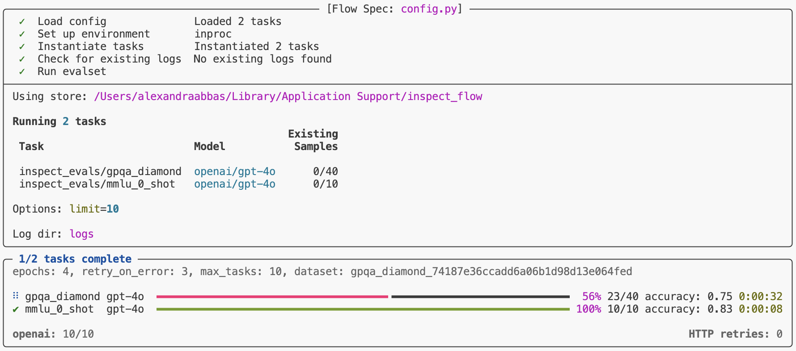
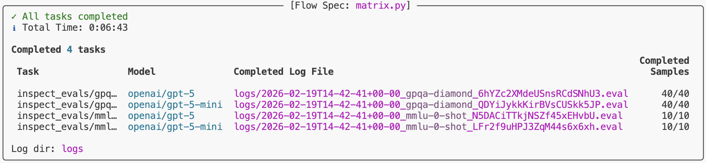
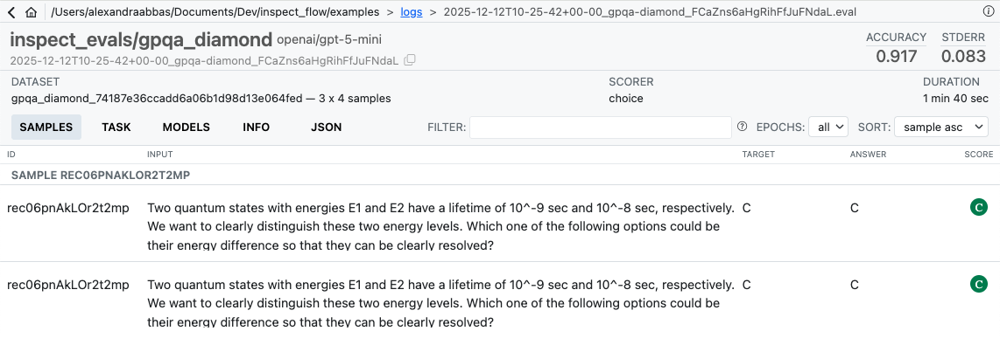

# Inspect Flow

Workflow orchestration for [Inspect AI](https://inspect.aisi.org.uk/) that enables you to run evaluations at scale with repeatability and maintainability.

## Why Inspect Flow?

As evaluation workflows grow in complexity—running multiple tasks across different models with varying parameters—managing these experiments becomes challenging. Inspect Flow addresses this by providing:

1. **Declarative Configuration**: Define complex evaluations with tasks, models, and parameters in type-safe schemas
2. **Repeatable & Shareable**: Encapsulated definitions of tasks, models, configurations, and Python dependencies ensure experiments can be reliably repeated and shared
3. **Incremental Execution**: Add new models, tasks, or configurations to existing results without re-running completed work
4. **Parameter Sweeping**: Matrix patterns for systematic exploration across tasks, models, and hyperparameters

Inspect Flow is designed for researchers and engineers running systematic AI evaluations who need to scale beyond ad-hoc scripts.

## Getting Started

### Prerequisites

Before using Inspect Flow, you should:

- Have familiarity with [Inspect AI](https://inspect.aisi.org.uk/)
- Have an existing Inspect evaluation or use one from [inspect-evals](https://github.com/UKGovernmentBEIS/inspect_evals)

### Installation

```bash
pip install inspect-flow
```

## Basic Example

`FlowJob` is the main entrypoint for defining evaluation runs. At its core, it takes a list of tasks to run. Here's a simple example that runs two evaluations:

```python
from inspect_flow import FlowJob, FlowTask

FlowJob(
    log_dir="logs",
    tasks=[
        FlowTask(
            name="inspect_evals/gpqa_diamond",
            model="openai/gpt-4o",
        ),
        FlowTask(
            name="inspect_evals/mmlu_0_shot",
            model="openai/gpt-4o",
        ),
    ],
)
```

To run the evaluations, run the following command in your shell. This will create a virtual environment for this job run and install the dependencies. Note that task and model dependencies (like the `inspect-evals` and `openai` Python packages) are inferred and installed automatically.

```bash
flow run config.py
```

This will run both tasks and display progress in your terminal.



### Python API

You can run evaluations from Python instead of the command line.

```python
from inspect_flow import FlowJob, FlowTask
from inspect_flow.api import run

job = FlowJob(
    log_dir="logs",
    tasks=[
        FlowTask(
            name="inspect_evals/gpqa_diamond",
            model="openai/gpt-4o",
        ),
        FlowTask(
            name="inspect_evals/mmlu_0_shot",
            model="openai/gpt-4o",
        ),
    ],
)
run(job=job)
```

## Matrix Functions

Often you'll want to evaluate multiple tasks across multiple models. Rather than manually defining every combination, use `tasks_matrix` to generate all task-model pairs:

```python
from inspect_flow import FlowJob, tasks_matrix

FlowJob(
    log_dir="logs",
    tasks=tasks_matrix(
        task=[
            "inspect_evals/gpqa_diamond",
            "inspect_evals/mmlu_0_shot",
        ],
        model=[
            "openai/gpt-5",
            "openai/gpt-5-mini",
        ],
    ),
)
```

To preview the expanded config before running it, you can run the following command in your shell to ensure the generated config is the one that you intend to run.

```bash
flow config matrix.py
```

This command outputs the expanded configuration showing all 4 task-model combinations (2 tasks × 2 models).

```yaml
log_dir: logs
dependencies:
- inspect-evals
tasks:
- name: inspect_evals/gpqa_diamond
  model:
    name: openai/gpt-5
- name: inspect_evals/gpqa_diamond
  model:
    name: openai/gpt-5-mini
- name: inspect_evals/mmlu_0_shot
  model:
    name: openai/gpt-5
- name: inspect_evals/mmlu_0_shot
  model:
    name: openai/gpt-5-mini
```

`tasks_matrix` and `models_matrix` are powerful functions that can operate on multiple levels of nested matrixes which enable sophisticated parameter sweeping. Let's say you want to explore different reasoning efforts across models—you can achieve this with the `models_matrix` function.

```python
from inspect_flow import FlowJob, GenerateConfig, models_matrix, tasks_matrix

FlowJob(
    log_dir="logs",
    tasks=tasks_matrix(
        task=[
            "inspect_evals/gpqa_diamond",
            "inspect_evals/mmmu_0_shot",
        ],
        model=models_matrix(
            model=[
                "openai/gpt-5",
                "openai/gpt-5-mini",
            ],
            config=[
                GenerateConfig(reasoning_effort="minimal"),
                GenerateConfig(reasoning_effort="low"),
                GenerateConfig(reasoning_effort="medium"),
                GenerateConfig(reasoning_effort="high"),
            ],
        ),
    ),
)
```

For even more concise parameter sweeping, use `configs_matrix` to generate configuration variants. This produces the same 16 evaluations (2 tasks × 2 models × 4 reasoning levels) as above, but with less boilerplate:

```python
from inspect_flow import FlowJob, configs_matrix, models_matrix, tasks_matrix

FlowJob(
    log_dir="logs",
    tasks=tasks_matrix(
        task=[
            "inspect_evals/gpqa_diamond",
            "inspect_evals/mmmu_0_shot",
        ],
        model=models_matrix(
            model=[
                "openai/gpt-5",
                "openai/gpt-5-mini",
            ],
            config=configs_matrix(
                reasoning_effort=["minimal", "low", "medium", "high"],
            ),
        ),
    ),
)
```

### Run evaluations

To run the config:

```bash
flow run matrix.py
```

This will run all 16 evaluations (2 tasks × 2 models × 4 reasoning levels). When complete, you'll find a link to the logs at the bottom of the task results summary.



To view logs interactively, run:

```bash
inspect view --log-dir logs
```



## Learning More

See the following articles to learn more about using Flow:

- [Flow Concepts](https://meridianlabs-ai.github.io/inspect_flow/flow_concepts.html): Flow type system, config structure and basics.
- [Reference](https://meridianlabs-ai.github.io/inspect_flow/reference/): Detailed documentation on the Flow Python API and CLI commands.

## Development

To work on development of Inspect Flow, clone the repository and install with the `-e` flag and `[dev, doc]` optional dependencies:

```bash
git clone https://github.com/meridianlabs-ai/inspect_flow
cd inspect_flow
uv sync
source .venv/bin/activate
```

Optionally install pre-commit hooks via

```bash
make hooks
```

Run linting, formatting, and tests via

```bash
make check
make test
```
