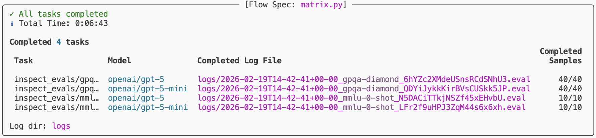

## Introduction

Inspect Flow is a workflow orchestration tool for [Inspect AI](https://inspect.aisi.org.uk/) that enables you to define, run, and manage evaluations at scale — from configuration through to production.

**Why Inspect Flow?** As evaluation workflows grow in complexity—running multiple tasks across different models with varying parameters, then reviewing, validating, and promoting results—managing these experiments becomes challenging. Inspect Flow addresses this by providing:

1.  [**Declarative Configuration**](spec.qmd): Define complex evaluations with tasks, models, and parameters in type-safe schemas
2.  [**Global Log Reuse**](store.qmd): Flow Store indexes evaluation logs and enables cross-directory reuse, so you only run what's new or changed
3.  [**Powerful Defaults**](defaults.qmd): Define defaults once and reuse them everywhere with automatic inheritance
4.  [**Parameter Sweeping**](matrix.qmd): Matrix patterns for systematic exploration across tasks, models, and hyperparameters
5.  [**Post-Evaluation Workflows**](steps.qmd): Tag, validate, and promote evaluation logs with composable steps

Inspect Flow is designed for researchers and engineers running systematic AI evaluations who need to scale beyond ad-hoc scripts.

## Getting Started

::: callout-note
### Prerequisites

Before using Inspect Flow, you should:

-   Have familiarity with [Inspect AI](https://inspect.aisi.org.uk/)
-   Have an existing Inspect evaluation or use one from [inspect-evals](https://github.com/UKGovernmentBEIS/inspect_evals)
:::

### Installation

Install the `inspect-flow` package from PyPI as follows:

``` bash
pip install inspect-flow
```

### Set up API keys

You'll need API keys for the model providers you want to use. Set the relevant provider API key in your `.env` file or export it in your shell:

::: {.panel-tabset .code-tabset}
#### OpenAI

``` bash
export OPENAI_API_KEY=your-openai-api-key
```

#### Anthropic

``` bash
export ANTHROPIC_API_KEY=your-anthropic-api-key
```

#### Google

``` bash
export GOOGLE_API_KEY=your-google-api-key
```

#### Grok

``` bash
export GROK_API_KEY=your-grok-api-key
```

#### Mistral

``` bash
export MISTRAL_API_KEY=your-mistral-api-key
```

#### Hugging Face

``` bash
export HF_TOKEN=your-hf-token
```
:::

### Optional: VS Code extension

Optionally install the [Inspect AI VS Code Extension](https://inspect.aisi.org.uk/vscode.html) which includes features for viewing evaluation log files.

## Basic Example

Let's walk through creating your first Flow configuration. We'll use `FlowSpec` (the entrypoint class) and `FlowTask` to define evaluations.

::: {.callout-tip collapse="true"}
### Core Components Reference

-   `FlowSpec` — Pydantic class that encapsulates the declarative description of a Flow spec.
-   `FlowTask` — Pydantic class abstraction on top of Inspect AI [Task](https://inspect.aisi.org.uk/tasks.html).
-   `FlowModel` — Pydantic class abstraction on top of Inspect AI [Model](https://inspect.aisi.org.uk/models.html).
-   `tasks_matrix()` — Helper function for parameter sweeping to generate a list of tasks with all parameter combinations.
-   `models_matrix()` — Helper function for parameter sweeping to generate a list of models with all parameter combinations.
-   `configs_matrix()` — Helper function for parameter sweeping to generate a list of GenerateConfig with all parameter combinations.
:::

`FlowSpec` is the main entrypoint for defining evaluation runs. At its core, it takes a list of tasks to run. Here's a simple example that runs two evaluations:

``` {.python filename="config.py"}

```

To run the evaluations, execute the following command. Make sure you have the necessary dependencies installed (like `inspect-evals` and `openai` for this example).

``` bash
flow run config.py
```

Both tasks will run with progress displayed in your terminal.


### Python API

You can run evaluations from Python instead of the command line by calling the `run()` function with a `FlowSpec`.

``` {.python filename="config.py"}

```

## Matrix Functions

Often you'll want to evaluate multiple tasks across multiple models. Rather than manually defining every combination, use `tasks_matrix` to generate all task-model pairs:

``` {.python filename="matrix.py"}

```

To preview the expanded config before running it, you can run the following command in your shell to ensure the generated config is the one that you intend to run.

``` bash
flow config matrix.py
```

This command outputs the expanded configuration showing all 4 task-model combinations (2 tasks × 2 models).

``` {.yml filename="matrix.yml"}

```

Flow provides additional matrix functions (`models_matrix`, `configs_matrix`) for sweeping over model settings, generation configs, and more. See [Matrixing](matrix.qmd) for details.

## Run Evaluations

Before running evaluations, preview what would run with `--dry-run`:

``` bash
flow run matrix.py --dry-run
```

This performs the full setup process—importing tasks from the registry, applying all defaults, expanding all matrix functions, and checking for existing logs—showing exactly what would run, but stops before actually running the evaluations.

To run the config:

``` bash
flow run matrix.py
```

When complete, you'll find a link to the logs at the bottom of the task results summary.



To view logs interactively, run:

``` bash
inspect view --log-dir logs
```

{width=80%}

## After Running

Once evaluations complete, use [steps](steps.qmd) to operate on the resulting logs. For example, tag logs after reviewing them:

``` bash
flow step tag logs/ --add reviewed --reason "Manually inspected"
```

Use `flow check` to verify the completeness of a spec against a log directory — for example, checking how much of a production directory has been filled:

``` bash
flow check matrix.py --log-dir s3://bucket/prod/logs
```

Steps can be composed into full workflows — filtering, tagging, and copying logs between directories. See [Steps](steps.qmd) for custom steps, filters, and an end-to-end example.

## Learning More

See the following articles to learn more about using Flow:

-   [Spec](spec.qmd): Flow type system, config structure and basics.
-   [Flow Store](store.qmd): How Flow indexes evaluation logs and enables cross-directory reuse across runs.
-   [Defaults](defaults.qmd): Define defaults once and reuse them everywhere with automatic inheritance.
-   [Matrixing](matrix.qmd): Systematic parameter exploration with matrix and with functions.
-   [Steps](steps.qmd): Post-evaluation workflows — tag, validate, and promote logs with composable steps.
-   [Reference](reference/index.qmd): Detailed documentation on the Flow Python API and CLI commands.