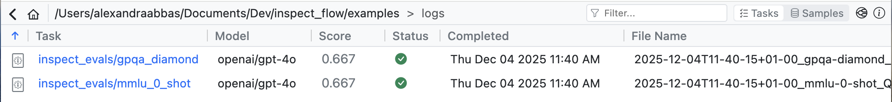
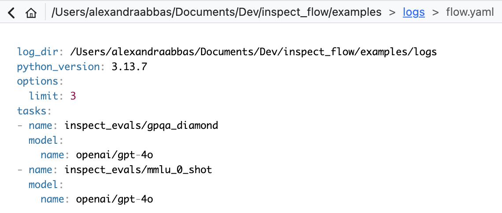

Once you've defined your Flow configuration, you can execute evaluations using the `flow run` command. Flow also provides tools for previewing configurations and controlling runtime behavior.

## Execution Modes

Flow supports two execution modes that determine how your evaluations run: **in-process (inproc)** and **virtual environment (venv)**. Understanding these modes helps you choose the right approach for your workflow.

### In-Process Mode (Default)

By default, Flow runs evaluations in your current Python process without creating an isolated environment.

**Characteristics:**

- Runs directly in your current Python environment
- No automatic dependency installation—you manage packages yourself
- Supports direct use of Inspect AI objects (`Task`, `Model`, `Solver`, `Agent`)
- Faster startup (no environment creation overhead)
- Best for development, iteration, and when you control the environment

**Example:**

``` {.python filename="inproc_mode.py"}

```

1. Direct Inspect AI Task object (supported in inproc mode)
2. Registry reference works in both modes

### Virtual Environment Mode

Opt into virtual environment mode for isolated, reproducible evaluation runs.

**Characteristics:**

- Creates a fresh, isolated virtual environment for each run
- Automatically installs dependencies from `pyproject.toml`, `uv.lock`, or `requirements.txt`
- Auto-detects and installs packages based on config (e.g., `model="openai/gpt-4"` → installs `openai`)
- Requires Flow types only—cannot use direct Inspect AI objects (`Task`, `Model`, etc.)
- Best for reproducibility and sharing

**Example:**

``` {.python filename="venv_mode.py"}

```

1. Enable virtual environment mode
2. Optional: specify Python version

Or use the CLI flag:

``` bash
flow run config.py --venv
```

### Choosing Between Modes

| Consideration | In-Process (inproc) | Virtual Environment (venv) |
|---------------|---------------------|----------------------------|
| **Default** | Yes ✓ | No (opt-in) |
| **Dependency installation** | Manual | Automatic |
| **Startup speed** | Fast | Slower (creates venv) |
| **Inspect AI objects** | Supported | Not supported |
| **Reproducibility** | Requires manual setup | Built-in |
| **Isolation** | Uses current environment | Fresh environment |
| **Best for** | Development, iteration | Production, sharing, CI/CD |

::: callout-tip
### Dependency Management in In-Process Mode

Even though in-process mode doesn't install dependencies automatically, Flow still generates a `flow-requirements.txt` file in your log directory that captures your current environment. This helps with reproducibility by documenting what packages were installed when you ran the evaluation.
:::

## The `flow run` Command

Execute your evaluation workflow:

``` bash
flow run config.py
```

**What happens when you run this (in-process mode, the default):**

1.  Flow loads your configuration file
2.  Resolves all defaults and matrix expansions
3.  Executes evaluations via Inspect AI's `eval_set()` in the current Python process
4.  Stores logs in `log_dir`
5.  Generates `flow-requirements.txt` to document the current environment

::: callout-note
In virtual environment mode (`execution_type="venv"` or `--venv` flag), Flow additionally creates an isolated virtual environment, installs dependencies, and cleans up the temporary environment after completion.
:::

### Common CLI Flags

**Preview without running:**

``` bash
flow run config.py --dry-run
```

Shows the completely resolved configuration:

- Applies all defaults
- Expands all matrix functions
- Instantiates all Python objects
- In venv mode: creates virtual environment and installs dependencies

This is invaluable for debugging what settings will actually be used in your evaluations.

**Override log directory:**

``` bash
flow run config.py --log-dir ./experiments/baseline
```

Changes where logs and results are stored.

**Runtime overrides:**

``` bash
flow run config.py \
  --set options.limit=100 \
  --set defaults.config.temperature=0.5
```

Override any configuration value at runtime. See [CLI Overrides](defaults.qmd#cli-overrides) for more details.

## The `flow config` Command

Preview your configuration before running:

``` bash
flow config config.py
```

Displays the parsed configuration as YAML with CLI overrides applied. Does not create a virtual environment, install dependencies, or instantiate Python objects—it only parses and resolves the configuration file.

::: callout-tip
### When to Use Each Command

-   **`flow config`** - Quick syntax check, verify overrides
-   **`flow run --dry-run`** - Debug defaults resolution, inspect final settings
-   **`flow run`** - Execute evaluations
:::

## Running from Python

You can run Flow evaluations programmatically using the Python API:

``` {.python filename="run.py"}

```

The `inspect_flow.api` module provides three functions:

- **`run()`** - Execute a Flow spec with full environment setup (equivalent to `flow run`)
- **`load_spec()`** - Load a Flow configuration from a Python file into a `FlowSpec` object
- **`config()`** - Get the resolved configuration as YAML (equivalent to `flow config`)

See the [API Reference](reference/inspect_flow.api.qmd) for detailed parameter documentation.

## Results and Logs

### Logs Directory

Evaluation results are stored in the `log_dir`:

```
logs/
├── 2025-11-21T17-38-20+01-00_gpqa-diamond_KvJBGowidXSCLRhkKQbHYA.eval
├── 2025-11-21T17-38-20+01-00_mmlu-0-shot_Vnu2A3M2wPet5yobLiCQmZ.eval
├── .eval-set-id
├── eval-set.json
├── flow.yaml
├── flow-requirements.txt
└── ...
```

**Directory structure:**

-   Flow passes the `log_dir` directly to Inspect AI `eval_set()` for evaluation log storage
-   Inspect AI handles the actual evaluation log file naming and storage
-   Log file naming conventions follow Inspect AI's standards (see [Inspect AI logging docs](https://inspect.aisi.org.uk/eval-logs.html#log-file-name))
-   Flow automatically saves the resolved configuration as `flow.yaml` in the log directory
-   Flow saves a snapshot of installed packages as `flow-requirements.txt`:
    - In **venv mode**: captures packages installed in the isolated environment
    - In **inproc mode**: captures packages from your current environment
-   The `.eval-set-id` file contains the eval set identifier
-   The `eval-set.json` file contains eval set metadata

**Log formats:**

-   `.eval` - Binary Inspect AI log format (default, high-performance)
-   `.json` - JSON format (if `log_format="json"` in `FlowOptions`)

### Viewing Results

**Using [Inspect View](https://inspect.aisi.org.uk/log-viewer.html):**

``` bash
inspect view
```

Opens the Inspect AI viewer to explore evaluation logs interactively.
[Inspect View](https://inspect.aisi.org.uk/log-viewer.html) can automatically detect Flow config files in the log directory and render them in the UI, making it easier to review the spec for the evaluations.

Click the Flow icon in the top right hand corner to view the Flow config.



The Flow config file is rendered in YAML format.

{width=60%}

### S3 Support

Store logs directly to S3:

``` python
FlowSpec(
    log_dir="s3://my-bucket/experiments/baseline",
    tasks=[...]
)
```

For more information on configuring an S3 bucket as a logs directory, refer to the Inspect AI [documentation](https://inspect.aisi.org.uk/eval-logs.html#sec-amazon-s3).