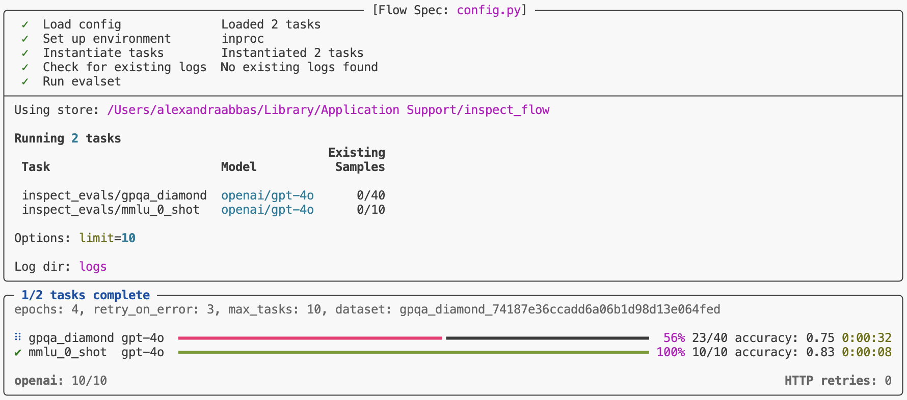
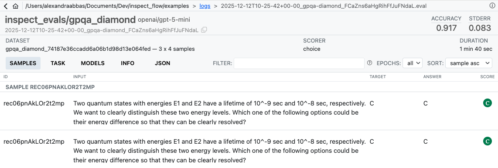

# Inspect Flow


## Introduction

Inspect Flow is a workflow orchestration tool for [Inspect
AI](https://inspect.aisi.org.uk/) that enables you to run evaluations at
scale with repeatability and maintainability.

**Why Inspect Flow?** As evaluation workflows grow in complexity—running
multiple tasks across different models with varying parameters—managing
these experiments becomes challenging. Inspect Flow addresses this by
providing:

1.  [**Declarative Configuration**](flow_concepts.qmd): Define complex
    evaluations with tasks, models, and parameters in type-safe schemas
2.  [**Global Log Reuse**](store.qmd): Flow Store tracks and reuses past
    evaluation logs, so you only run what’s new or changed
3.  [**Powerful Defaults**](defaults.qmd): Define defaults once and
    reuse them everywhere with automatic inheritance
4.  [**Parameter Sweeping**](matrix.qmd): Matrix patterns for systematic
    exploration across tasks, models, and hyperparameters

Inspect Flow is designed for researchers and engineers running
systematic AI evaluations who need to scale beyond ad-hoc scripts.

## Getting Started

> [!NOTE]
>
> ### Prerequisites
>
> Before using Inspect Flow, you should:
>
> - Have familiarity with [Inspect AI](https://inspect.aisi.org.uk/)
> - Have an existing Inspect evaluation or use one from
>   [inspect-evals](https://github.com/UKGovernmentBEIS/inspect_evals)

### Installation

Install the `inspect-flow` package from PyPI as follows:

``` bash
pip install inspect-flow
```

### Set up API keys

You’ll need API keys for the model providers you want to use. Set the
relevant provider API key in your `.env` file or export it in your
shell:

#### OpenAI

``` bash
export OPENAI_API_KEY=your-openai-api-key
```

#### Anthropic

``` bash
export ANTHROPIC_API_KEY=your-anthropic-api-key
```

#### Google

``` bash
export GOOGLE_API_KEY=your-google-api-key
```

#### Grok

``` bash
export GROK_API_KEY=your-grok-api-key
```

#### Mistral

``` bash
export MISTRAL_API_KEY=your-mistral-api-key
```

#### Hugging Face

``` bash
export HF_TOKEN=your-hf-token
```

### Optional: VS Code extension

Optionally install the [Inspect AI VS Code
Extension](https://inspect.aisi.org.uk/vscode.html) which includes
features for viewing evaluation log files.

## Basic Example

Let’s walk through creating your first Flow configuration. We’ll use
`FlowSpec` (the entrypoint class) and `FlowTask` to define evaluations.

> [!TIP]
>
> ### Core Components Reference
>
> - `FlowSpec` — Pydantic class that encapsulates the declarative
>   description of a Flow spec.
> - `FlowTask` — Pydantic class abstraction on top of Inspect AI
>   [Task](https://inspect.aisi.org.uk/tasks.html).
> - `FlowModel` — Pydantic class abstraction on top of Inspect AI
>   [Model](https://inspect.aisi.org.uk/models.html).
> - `tasks_matrix()` — Helper function for parameter sweeping to
>   generate a list of tasks with all parameter combinations.
> - `models_matrix()` — Helper function for parameter sweeping to
>   generate a list of models with all parameter combinations.
> - `configs_matrix()` — Helper function for parameter sweeping to
>   generate a list of GenerateConfig with all parameter combinations.

`FlowSpec` is the main entrypoint for defining evaluation runs. At its
core, it takes a list of tasks to run. Here’s a simple example that runs
two evaluations:

**config.py**

``` python
from inspect_flow import FlowSpec, FlowTask

FlowSpec(
    log_dir="logs",
    tasks=[
        FlowTask(
            name="inspect_evals/gpqa_diamond",
            model="openai/gpt-4o",
        ),
        FlowTask(
            name="inspect_evals/mmlu_0_shot",
            model="openai/gpt-4o",
        ),
    ],
)
```

To run the evaluations, execute the following command. Make sure you
have the necessary dependencies installed (like `inspect-evals` and
`openai` for this example).

``` bash
flow run config.py
```

Both tasks will run with progress displayed in your terminal.



### Python API

You can run evaluations from Python instead of the command line by
calling the `run()` function with a `FlowSpec`.

**config.py**

``` python
from inspect_flow import FlowSpec, FlowTask
from inspect_flow.api import run

spec = FlowSpec(
    log_dir="logs",
    tasks=[
        FlowTask(
            name="inspect_evals/gpqa_diamond",
            model="openai/gpt-4o",
        ),
        FlowTask(
            name="inspect_evals/mmlu_0_shot",
            model="openai/gpt-4o",
        ),
    ],
)
run(spec=spec)
```

## Matrix Functions

Often you’ll want to evaluate multiple tasks across multiple models.
Rather than manually defining every combination, use `tasks_matrix` to
generate all task-model pairs:

**matrix.py**

``` python
from inspect_flow import FlowSpec, tasks_matrix

FlowSpec(
    log_dir="logs",
    tasks=tasks_matrix(
        task=[
            "inspect_evals/gpqa_diamond",
            "inspect_evals/mmlu_0_shot",
        ],
        model=[
            "openai/gpt-5",
            "openai/gpt-5-mini",
        ],
    ),
)
```

To preview the expanded config before running it, you can run the
following command in your shell to ensure the generated config is the
one that you intend to run.

``` bash
flow config matrix.py
```

This command outputs the expanded configuration showing all 4 task-model
combinations (2 tasks × 2 models).

**matrix.yml**

``` yml
log_dir: logs
tasks:
- name: inspect_evals/gpqa_diamond
  model: openai/gpt-5
- name: inspect_evals/gpqa_diamond
  model: openai/gpt-5-mini
- name: inspect_evals/mmlu_0_shot
  model: openai/gpt-5
- name: inspect_evals/mmlu_0_shot
  model: openai/gpt-5-mini
```

`tasks_matrix` and `models_matrix` are powerful functions that can
operate on multiple levels of nested matrixes which enable sophisticated
parameter sweeping. Let’s say you want to explore different reasoning
efforts across models—you can achieve this with the `models_matrix`
function.

**models_matrix.py**

``` python
from inspect_ai.model import GenerateConfig
from inspect_flow import FlowSpec, models_matrix, tasks_matrix

FlowSpec(
    log_dir="logs",
    tasks=tasks_matrix(
        task=[
            "inspect_evals/gpqa_diamond",
            "inspect_evals/mmlu_0_shot",
        ],
        model=models_matrix(
            model=[
                "openai/gpt-5",
                "openai/gpt-5-mini",
            ],
            config=[
                GenerateConfig(reasoning_effort="minimal"),
                GenerateConfig(reasoning_effort="low"),
                GenerateConfig(reasoning_effort="medium"),
                GenerateConfig(reasoning_effort="high"),
            ],
        ),
    ),
)
```

For even more concise parameter sweeping, use `configs_matrix` to
generate configuration variants. This produces the same 16 evaluations
(2 tasks × 2 models × 4 reasoning levels) as above, but with less
boilerplate:

**configs_matrix.py**

``` python
from inspect_flow import FlowSpec, configs_matrix, models_matrix, tasks_matrix

FlowSpec(
    log_dir="logs",
    tasks=tasks_matrix(
        task=[
            "inspect_evals/gpqa_diamond",
            "inspect_evals/mmlu_0_shot",
        ],
        model=models_matrix(
            model=[
                "openai/gpt-5",
                "openai/gpt-5-mini",
            ],
            config=configs_matrix(
                reasoning_effort=["minimal", "low", "medium", "high"],
            ),
        ),
    ),
)
```

### Run evaluations

Before running evaluations, preview what would run with `--dry-run`:

``` bash
flow run matrix.py --dry-run
```

This performs the full setup process—importing tasks from the registry,
applying all defaults, expanding all matrix functions, and checking for
existing logs—showing exactly what would run, but stops before actually
running the evaluations.

To run the config:

``` bash
flow run matrix.py
```

This will run all 16 evaluations (2 tasks × 2 models × 4 reasoning
levels). When complete, you’ll find a link to the logs at the bottom of
the task results summary.


To view logs interactively, run:

``` bash
inspect view --log-dir logs
```



## Learning More

See the following articles to learn more about using Flow:

- [Flow Concepts](flow_concepts.qmd): Flow type system, config structure
  and basics.
- [Flow Store](store.qmd): How Flow tracks and reuses evaluation logs
  across runs—automatically skipping redundant work.
- [Defaults](defaults.qmd): Define defaults once and reuse them
  everywhere with automatic inheritance.
- [Matrixing](matrix.qmd): Systematic parameter exploration with matrix
  and with functions.
- [Reference](reference/index.qmd): Detailed documentation on the Flow
  Python API and CLI commands.
