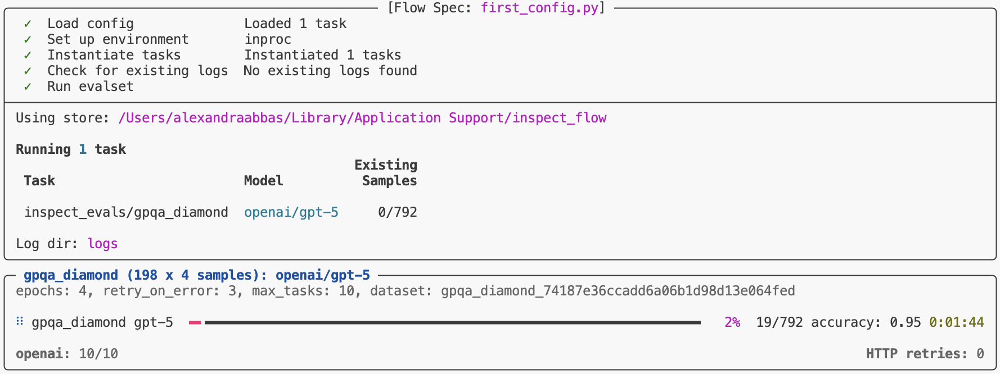

# Spec – Inspect Flow

[FlowSpec](./reference/inspect_flow.html.md#flowspec) is the declarative interface for defining evaluations in Inspect Flow. A [FlowSpec](./reference/inspect_flow.html.md#flowspec) defines the log directory, tasks, models, and other options that make up a spec. When Inspect Flow processes the [FlowSpec](./reference/inspect_flow.html.md#flowspec), it resolves the configuration into a list of evaluation tasks to be run. These tasks are provided to Inspect’s `eval_set()` function along with any additional configuration, and Inspect executes the tasks.

Inspect Flow mirrors Inspect AI’s object model with corresponding Flow types:

- **[FlowSpec](./reference/inspect_flow.html.md#flowspec)** — The top-level spec definition. Contains a list of tasks and spec settings. Under the hood it translates to an Inspect AI [Eval Set](https://inspect.aisi.org.uk/eval-sets.html).
- **[FlowTask](./reference/inspect_flow.html.md#flowtask)** — Configuration for a single evaluation task. Maps to Inspect AI [Task](https://inspect.aisi.org.uk/tasks.html) parameters.
- **[FlowModel](./reference/inspect_flow.html.md#flowmodel)** — Model configuration including API settings and generation settings. Maps to Inspect AI [Model](https://inspect.aisi.org.uk/models.html).
- **[FlowSolver](./reference/inspect_flow.html.md#flowsolver)** and **[FlowAgent](./reference/inspect_flow.html.md#flowagent)** — Solver and agent chain configuration. Map to Inspect AI [Solver](https://inspect.aisi.org.uk/solvers.html) and [Agent](https://inspect.aisi.org.uk/agents.html).
- **[FlowScorer](./reference/inspect_flow.html.md#flowscorer)** — Configuration for a Scorer. Maps to Inspect AI [Scorer](https://inspect.aisi.org.uk/scorer.html).
- **[FlowOptions](./reference/inspect_flow.html.md#flowoptions)** — Runtime execution options. Maps to Inspect AI [eval_set()](https://inspect.aisi.org.uk/reference/inspect_ai.html#eval_set) parameters.
- **[FlowDefaults](./reference/inspect_flow.html.md#flowdefaults)** — System for setting default values across tasks, models, solvers, and agents.
- **[FlowDependencies](./reference/inspect_flow.html.md#flowdependencies)** — Configuration for evaluation dependencies (used in virtual environment mode).

## Config Files

Flow configuration files are Python files where the last expression is either:

- A [FlowSpec](./reference/inspect_flow.html.md#flowspec) object, or
- A function that returns a [FlowSpec](./reference/inspect_flow.html.md#flowspec) object

Since config files are standard Python code, you can use all Python features including variables, loops, comprehensions, imports, and comments. Flow configs are just Python!

When using a function, its parameters become CLI arguments via `--arg`, letting you design a custom CLI interface for your config. See [this example](https://github.com/meridianlabs-ai/inspect_flow/blob/main/examples/flow_args.py) for usage.

Flow also supports YAML config files (`.yaml`/`.yml`) for purely declarative specs. See [this example](https://github.com/meridianlabs-ai/inspect_flow/blob/main/examples/first_config.yml) for usage.

> **NOTE: Note**
>
> The last expression requirement only applies when loading Python configs from files (via CLI or [load_spec()](./reference/inspect_flow.api.html.md#load_spec)). When using the Python API directly with [run()](./reference/inspect_flow.api.html.md#run), you pass the [FlowSpec](./reference/inspect_flow.html.md#flowspec) object programmatically—no file or last expression needed.

## Basic Example

In [Welcome - Basic Example](./index.html.md#basic-example), we showed a simple [FlowSpec](./reference/inspect_flow.html.md#flowspec). Let’s break down what’s happening:

    first_config.py

``` python
from inspect_flow import FlowSpec, FlowTask

FlowSpec(
1    log_dir="logs",
2    tasks=[
        FlowTask(
3            name="inspect_evals/gpqa_diamond",
4            model="openai/gpt-5",
        ),
    ],
)
```

1  
Specify the directory for storing logs

2  
List evaluation tasks to run

3  
Specify task from registry by name

4  
Specify model to evaluate by name

To run the task, first ensure you have the necessary dependencies installed (`inspect-evals` and `openai` for this example), then run the following command in your shell.

``` bash
flow run first_config.py
```

Alternatively, use the `--venv` flag to automatically install dependencies in an isolated virtual environment:

``` bash
flow run first_config.py --venv
```



Progress bar in terminal

**What happens when you run this (default in-process mode)?**

1.  Flow loads the `gpqa_diamond` task from the `inspect_evals` registry
2.  Checks for existing logs to reuse in the log directory (and the [Flow Store](./store.html.md) if `--store-read` is enabled)
3.  Runs the evaluation with GPT-5 in the current Python process
4.  Stores results in `logs/`

When using `--venv`, Flow additionally creates an isolated virtual environment, installs dependencies automatically, executes the evaluation in that environment, and cleans up the temporary environment after completion.

## Jobs

[FlowSpec](./reference/inspect_flow.html.md#flowspec) is the primary interface for defining Flow workflows. All Flow operations—including [parameter sweeps and matrix expansions](./matrix.html.md)—ultimately produce a list of tasks that [FlowSpec](./reference/inspect_flow.html.md#flowspec) executes.

**Required fields:**

| Field | Description |
|----|----|
| `log_dir` | Output path for logging results. Supports S3 paths (e.g., `s3://bucket/path`) |

**Optional fields:**

| Field | Description | Default |
|----|----|----|
| `tasks` | List of tasks to run ([FlowTask](./reference/inspect_flow.html.md#flowtask) objects, Inspect AI `Task` objects, or strings) | `None` |
| `includes` | List of other flow configs to include (paths as strings). Relative paths resolved relative to config file (CLI) or `base_dir` arg (API). Additionally, any `_flow.py` files in the same directory or parent directories are automatically included | `None` |
| `log_dir_create_unique` | If `True`, create a unique subdirectory under `log_dir` using the current datetime (e.g. `2025-12-09T17-36-43`). If `False`, use existing directory (must only contain logs from tasks in the spec or have `options.log_dir_allow_dirty=True`) | `False` |
| `execution_type` | Execution environment: `"inproc"` runs tasks in the current Python process, `"venv"` runs tasks in an isolated virtual environment | `"inproc"` |
| `python_version` | Python version for the isolated virtual environment when `execution_type="venv"` (e.g., `"3.11"`) | Same as current environment |
| `dependencies` | [FlowDependencies](./reference/inspect_flow.html.md#flowdependencies) object configuring package installation in venv mode. Controls dependency file detection, additional packages, and auto-detection behavior. Ignored in inproc mode. | Auto-detect from `pyproject.toml` or `requirements.txt`, and config object names (venv mode only) |
| `env` | Environment variables to set when running tasks | `None` |
| `options` | Runtime options passed to `eval_set` (see [FlowOptions](./reference/inspect_flow.html.md#flowoptions) reference) | `None` |
| `defaults` | Default values applied across tasks, models, solvers, and agents (see [Defaults](./defaults.html.md) and [FlowDefaults](./reference/inspect_flow.html.md#flowdefaults) reference) | `None` |
| `store` | Flow Store configuration for indexing and reusing logs across runs. Accepts a path string, [FlowStoreConfig](./reference/inspect_flow.html.md#flowstoreconfig), or `None` to disable. `"auto"` uses the platform-specific [default location](./store.html.md#backend). See [Flow Store](./store.html.md) | `"auto"` |
| `flow_metadata` | Metadata stored in the flow config (not passed to Inspect AI, see [flow_metadata](./advanced.html.md#flow_metadata-flow-only-metadata)) | `None` |

## Tasks

[FlowTask](./reference/inspect_flow.html.md#flowtask) defines the configuration for a single evaluation. Each [FlowTask](./reference/inspect_flow.html.md#flowtask) maps to an Inspect AI [Task](https://inspect.aisi.org.uk/tasks.html) and accepts the same parameters—including the model to evaluate, solver chain, generation config, sandbox environment, and dataset filters.

### Specification

Flow supports multiple ways to specify tasks, from simple registry names to programmatic Task objects. Choose the approach that best fits your needs:

- **Registry names and file paths**: Use `name` to reference tasks from packages or local files
- **Task factory functions**: Use `factory` to provide a callable, [FlowFactory](./reference/inspect_flow.html.md#flowfactory), or string reference that creates the task. If both `name` and `factory` are set, `name` is used as the display name in logs.
- **Direct Task objects**: Pass Task objects directly to `FlowSpec.tasks` when you don’t need Flow-level parameter overrides

**Registry Name**

``` python
# Tasks from installed packages
FlowTask(
    name="inspect_evals/gpqa_diamond",
    model="openai/gpt-5"
)
```

**File Path**

``` python
# Auto-discovers `@task` decorated functions in the specified file and creates a task for each of them
FlowTask(
    name="./my_task.py",
    model="openai/gpt-5"
)
```

**File with Function**

``` python
# Explicitly selects a specific function from the file
FlowTask(
    name="./my_task.py@custom_eval",
    model="openai/gpt-5"
)
```

**Task Factory Function**

``` python
# Use a factory function that returns an Inspect AI Task
from inspect_ai import Task, task
from inspect_ai.dataset import example_dataset
from inspect_ai.solver import generate
from inspect_flow import FlowTask

@task  # @task decorator makes the function available in the registry and ensures that tasks with different args are considered unique
def my_task_factory():
    return Task(dataset=example_dataset("security_guide"), solver=generate())

FlowTask(
    name="optional_name",  # Optional: override the task name
    factory=my_task_factory,
    model="openai/gpt-5",  # Override the model
)
```

**Type-Checked Factory Arguments**

Use [FlowFactory](./reference/inspect_flow.html.md#flowfactory) to get IDE type checking on factory arguments. This works with all Flow types ([FlowTask](./reference/inspect_flow.html.md#flowtask), [FlowAgent](./reference/inspect_flow.html.md#flowagent), [FlowSolver](./reference/inspect_flow.html.md#flowsolver), [FlowScorer](./reference/inspect_flow.html.md#flowscorer), [FlowModel](./reference/inspect_flow.html.md#flowmodel)):

``` python
from inspect_flow import FlowTask, FlowFactory

FlowTask(
    factory=FlowFactory(my_task_factory, "subset", use_system_prompt=True),
    model="openai/gpt-5",
)
```

[FlowFactory](./reference/inspect_flow.html.md#flowfactory) binds arguments to the factory function’s signature at construction time, so type errors are caught immediately rather than at evaluation time.

**Direct Task Object in FlowSpec**

    direct_task_object.py

``` python
# Pass Task objects directly to FlowSpec.tasks
# Use this when you don't need to override task parameters
from inspect_ai import Task, task
from inspect_ai.dataset import example_dataset
from inspect_ai.solver import generate
from inspect_flow import FlowSpec


@task  # Optional: use @task decorator to make function available in the registry
def my_custom_task():
    return Task(
        dataset=example_dataset("security_guide"),
        solver=generate(),
    )


FlowSpec(
    log_dir="logs",
    tasks=[
        my_custom_task(),
        "inspect_evals/gpqa_diamond",
    ],
)
```

### Configuration

[FlowTask](./reference/inspect_flow.html.md#flowtask) accepts parameters that map to Inspect AI [Task](https://inspect.aisi.org.uk/tasks.html) fields. The examples below show commonly used fields; see the [FlowTask](./reference/inspect_flow.html.md#flowtask) reference documentation for the complete list of available parameters.

``` python
FlowTask(
1    name="inspect_evals/mmlu_0_shot",
2    model="openai/gpt-5",
3    epochs=3,
4    config=GenerateConfig(
        temperature=0.7,
        max_tokens=1000,
    ),
5    solver="chain_of_thought",
6    args={"subject": "physics"},
7    sandbox="docker",
8    sample_id=[0, 1, 2],
9    tags=["safety-testing"],
10    extra_args=FlowExtraArgs(
        solver={"max_attempts": 3}
    ),
)
```

1  
**Task name or factory** — Use `name` to specify a task by registry name (`"inspect_evals/mmlu"`), file path (`"./task.py"`), or file with function (`"./task.py@eval_fn"`). Alternatively, use `factory` to provide a callable or a string reference that returns an Inspect AI `Task` object (see [Task Factory Function](#specification) example above). If both `name` and `factory` are provided, `factory` is used to create the task and `name` sets the task name in logs. When using `factory`, you can still override task parameters like `model`, `solver`, or `config` via other [FlowTask](./reference/inspect_flow.html.md#flowtask) fields.

2  
**Model** — Maps to Inspect AI `Task.model`. Optional model for this task. If not specified, uses the model from `INSPECT_EVAL_MODEL` environment variable. Can be a string (`"openai/gpt-5"`), a [FlowModel](./reference/inspect_flow.html.md#flowmodel) object for advanced configuration, or an Inspect AI `Model` object.

3  
**Epochs** — Maps to Inspect AI `Task.epochs`. Number of times to repeat evaluation over the dataset samples. Can be an integer (`epochs=3`) or a [FlowEpochs](./reference/inspect_flow.html.md#flowepochs) object to specify custom reducer functions (`FlowEpochs(epochs=3, reducer="median")`). By default, scores are combined using the `"mean"` reducer across epochs.

4  
**Generation config** — Maps to Inspect AI `Task.config` (`GenerateConfig`). Model generation parameters like `temperature`, `max_tokens`, `top_p`, `reasoning_effort`, etc. These settings override config on `FlowSpec.config` but are overridden by settings on `FlowModel.config`.

5  
**Solver chain** — Maps to Inspect AI `Task.solver`. The algorithm(s) for solving the task. Can be a string (`"chain_of_thought"`), [FlowSolver](./reference/inspect_flow.html.md#flowsolver) object, [FlowAgent](./reference/inspect_flow.html.md#flowagent) object, Inspect AI `Solver` or `Agent` object, or a list of solvers for chaining. Defaults to `generate()` if not specified.

6  
**Task arguments** — Maps to task function parameters. Dictionary of arguments passed to the task constructor or `@task` decorated function. Enables parameterization of tasks (e.g., selecting dataset subsets, configuring difficulty levels).

7  
**Sandbox environment** — Maps to Inspect AI `Task.sandbox`. Can be a string (`"docker"`, `"local"`), a tuple with additional config, or a `SandboxEnvironmentType` object.

8  
**Sample selection** — Evaluate specific samples from the dataset. Accepts a single ID (`sample_id=0`), list of IDs (`sample_id=[0, 1, 2]`), or list of string IDs.

9  
**Tags** — Maps to Inspect AI `Task.tags`. A list of string tags to associate with the task, useful for categorizing and filtering evaluations.

10  
**Extra arguments** — Additional arguments to pass when creating Inspect AI objects (models, solvers, agents, scorers) for this specific task. Useful for per-task customization, such as providing different tools to an agent depending on the task. Values in `extra_args` override any args specified in the object’s own `args` field.

## Models

When specifying a task, you can provide the model for the task as a string with a model name, a [FlowModel](./reference/inspect_flow.html.md#flowmodel), or an Inspect AI `Model` object. When using the simple string, the default values for that model will be used. For example:

``` python
FlowTask(name="task", model="openai/gpt-5")
```

Using [FlowModel](./reference/inspect_flow.html.md#flowmodel) allows you to specify additional parameters for the model (e.g. `GenerateConfig`). Use [FlowModel](./reference/inspect_flow.html.md#flowmodel) when you need to set custom `GenerateConfig`, API endpoints, custom API keys for a specific model, or perform other custom configuration. For example:

``` python
FlowTask(
    name="task",
    model=FlowModel(
        name="openai/gpt-5",
        config=GenerateConfig(
            reasoning_effort="medium",
            max_connections=10,
        ),
        base_url="https://custom-endpoint.com",
        api_key="${CUSTOM_API_KEY}",
    )
)
```

You can also pass an Inspect AI `Model` object directly when you need programmatic model configuration:

``` python
from inspect_ai.model import get_model

# Create a Model instance with custom configuration
custom_model = get_model(
    "openai/gpt-5",
    config=GenerateConfig(reasoning_effort="high"),
    base_url="https://custom-endpoint.com"
)

FlowTask(
    name="task",
    model=custom_model
)
```

### Model Roles

For agent evaluations with multiple model roles, use `model_roles` to specify which model to use for each role. For example:

``` python
# For agent evaluations with multiple roles
FlowTask(
    name="multi_agent_task",
    model_roles={
        "assistant": "openai/gpt-5",
        "critic": "anthropic/claude-3-5-sonnet",
    }
)
```
